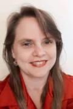
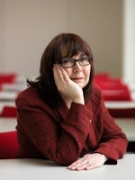
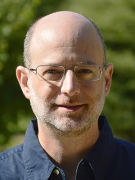
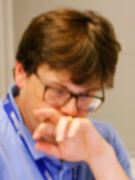
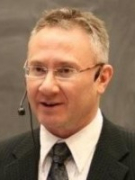

# Welcome to FAIReScience 2021 online workshop

_virtually co-located with the [17th IEEE eScience 2021](https://www.escience2021.org/)_

This discussion-focused workshop examines how the FAIR (Findable, Accessible, Interoperable, Reusable) principles are and can be applied to eScience research objects beyond data. Invited speakers will present the idea of FAIR and its application to objects such as software, workflows, machine learning models, and executable notebooks, and where FAIR is going. Invited talks will be followed by a panel discussion guided by questions suggested by the attendees. From the talks, questions and discussions, we plan a white paper to be written after the workshop, with workshop speakers and attendees as authors.

* When: 20 Sept 2021 at 16:00 CEST ([see it date and time in your timezone](https://www.timeanddate.com/worldclock/fixedtime.html?msg=FAIReScience&iso=20210920T16&p1=37&ah=4))
* Where: Connection details will be shared with registered attendees
* Registration: Visit the [eScience registration page](https://www.escience2021.org/registration)
* [Description](#description)
* [Agenda](#agenda)
* [Invited speakers](#invited-speakers)
* [Organizing committee](#organizing-committee)

## Description

This half-day workshop looks at how application of the FAIR (Findable, Accessible, Interoperable, Reusable) principles is expanding in eScience beyond data to encompass software, workflows, machine learning and executable notebooks, to frame group discussion on how to advance this work. The workshop brings together leaders of FAIR initiatives on diverse research objects to enable interactive dialogue on how these efforts can leverage each other’s work, and to consider the implications for the FAIR principles of their adoption in different contexts.
 
eScience promotes innovation in collaborative, computationally- or data-intensive research across all disciplines, throughout the research life cycle. This innovation has been traditionally captured in papers with text and images, and now is increasingly represented with additional digital objects, such as data, software, scripts, workflows, machine learning models, executable notebooks, etc. These objects are the actual usable scholarship, while the papers are merely static discussion about the scholarship. Thus, to build on previous scholarship, it's essential that these eScience research objects be made FAIR, both for humans and machines.
 
To address this, an initial effort to define a "DATA FAIRPORT" began in 2014 at a Lorentz workshop and transitioned into developing a set of FAIR data guiding principles in 2016. The details of the FAIR principles strongly contribute to addressing this goal with regard to research data, and the principles, at a high level, are intended to apply to all research objects; both those used in research and that form the outputs of research. While the findability and accessibility principles seem to pose no major challenges in this regard, the interpretation of what interoperability and reusability entail changes across different digital objects, e.g., software, workflows, training material. 
 
This session highlights some of the international efforts happening to broaden the application of FAIR principles to a diverse range of research objects.
* Software: The [FAIR for Research Software Working Group](https://www.rd-alliance.org/groups/fair-4-research-software-fair4rs-wg) is leading the development of community-endorsed application of the FAIR principles to software. Some of the high-level FAIR data principles can be directly applied to research software by treating software and data as similar digital research objects. However, specific characteristics of software, such as its executability, composite nature, and continuous evolution and versioning, make it necessary to revise and extend the original data principles. 
* Workflows: Computational workflows describe the complex multi-step methods that are used for data collection, data preparation, analytics, predictive modelling, and simulation that lead to new data products. They can inherently contribute to the FAIR data principles: by processing data according to established metadata; by creating metadata themselves during the processing of data; and by tracking and recording data provenance. These properties aid data quality assessment and contribute to secondary data usage. Moreover, workflows are digital objects in their own right. This paper argues that FAIR principles for workflows need to address their specific nature in terms of their composition of executable software steps, their provenance, and their development. Taken from [FAIR computational workflows](https://doi.org/10.1162/dint_a_00033)
* Machine Learning: Machine Learning models are a combination of a set of parameters and a particular platform that are combined to create a trained executable model that can be run on a set of data. We are currently co-leading an effort to define how [what FAIR means for these models in the Research Data Alliance](https://www.rd-alliance.org/defining-fair-machine-learning-ml)
* Executable notebooks: Executable notebooks, such as Jupyter notebooks, have encountered a huge growth over the last few days. Millions of example of notebooks are available on code repositories such as GitHub. Notebooks allow users to execute code, read documentation, access data that may be stored within the same folder as the notebook and generate visualisations on that data. The flexibility of notebooks raise questions about how FAIR principles should be applied to them. Are notebooks fundamentally instances of software or front ends to data sets or do they have some other purpose? The publishing notebook initiative of the [EarthCube project](https://www.earthcube.org/2021-earthcube-annual-meeting) is now in its second year and we will review some initial findings from there. 

## Agenda

| Starting at | Length| Activity | Participant |
| --- | --- | --- | --- | 
| 16:00 | 10' | Introduction to the workshop | Leyla Jael Castro | 
| 16:10 | 10' | FAIR for research software | Leyla Jael Castro | 
| 16:20 | 10' | FAIR for Workflows | Carole Goble | 
| 16:30 | 10' | Active break - Add your thoughts/questions to the board | All | 
| 16:40 | 10' | FAIR for Machine Learning | Daniel S. Katz | 
| 16:50 | 10' | FAIR for executable notebooks | Hugh Shanahan | 
| 17:00 | 10' | FAIR next steps | Mark D. Wilkinson | 
| 17:10 | 10' | Active break - Add your thoughts/questions to the board | All | 
| 17:20 | 20' | Coffee break | All | 
| 17:40 | 70' | Open discussion | Mark Leggott (moderator) and invited speakers |
| 18:50 | 15' | Final words | Invited speakers |
| 19:05 | 45' | White paper brainstorming | All (optional) |
| 19:50 | 10' | Wrap-up | Leyla Jael Castro |
| 20:00 |  | End of the workshop| |

## Invited speakers

| --- | --- |
|  Michelle Barker | Dr Michelle Barker has extensive expertise in open science, research software, digital workforce capability and digital research infrastructure. As a sociologist, Michelle is passionate about building collaborative partnerships to achieve system change. She is Co-chair of the [Research Data Alliance](https://www.rd-alliance.org/) [Organisational Advisory Board](https://rd-alliance.org/about-rda/our-leadership/rda-organisational-advisory-board.html), recently chaired the OECD Expert Group on [digital skills for the research sector](https://www.oecd-ilibrary.org/science-and-technology/building-digital-workforce-capacity-and-skills-for-data-intensive-science_e08aa3bb-en), was a member of the OECD Expert Group on [Socioeconomic Impact of Research Infrastructures](https://www.oecd-ilibrary.org/science-and-technology/reference-framework-for-assessing-the-scientific-and-socio-economic-impact-of-research-infrastructures_3ffee43b-en), and is a former Advisory Committee Member of the [US Software Sustainability Institute (URSSI)](http://urssi.us/). Michelle is a former Director of the [Australian Research Data Commons](https://ardc.edu.au/), where she led the strategic planning for the Australian government’s $180 million, five-year investment in ARDC, the [national research software infrastructure investment program](https://nectar.org.au/labs/), and developed a national strategy to enhance digital workforce capacity in the research sector. She has also has convened conferences including the [IEEE International Conference on e-Science](https://escience-conference.org/) [Workshop on Sustainable Software for Science: Practice and Experiences (WSSSPE)](https://escience-conference.org/), and the [International Workshop on Science Gateways](http://iwsg-life.org/site/iwsglife/). |
|  Carole Goble | Carole Goble CBE FREng FBCS is a Professor of Computer Science at the University of Manchester, UK where leads a team of Researchers, Research Software Engineers and Data Stewards. She has spent 25 years working in e-Science on computational workflows, reproducible science, open sharing, and knowledge and metadata management in a range of disciplines. She has led numerous e-Infrastructure projects including: Taverna, one of the first open source computational workflow management systems and [myExperiment.org](https://www.myexperiment.org/), the first system agnostic web-based sharing platform for workflows and their related data. She was the scientific lead of the [WF4ever project](http://wf4ever.org/) which pioneered the notion of workflows as preservable and reproducible Research Objects. She currently co-leads the WorkflowHub.eu registry for workflows, the [RO-Crate](https://www.researchobject.org/ro-crate/) community initiative for packaging, exchanging and publishing workflows as Research Objects and serves on the Advisory Board of the [Common Workflow Language](https://www.commonwl.org/). These are key components of the EOSC-Life Cluster Workflow Collaboratory (made up of 13 European Research Infrastructures in Biomedical Science) and a resource of the EU COVID data portal. The tools of the Collaboratory are used by other projects from natural history collection digitisation to climate change modelling. Carole is a co-founder of the [UK’s Software Sustainability Institute](https://www.software.ac.uk/) and cares about quality research software and reproducibility by building platforms people really use with teams of people distributed across projects, institutions and countries. Carole also leads the pan-institutional F[FAIRDOM Consortium](https://fair-dom.org/) which manages FAIR data for systems biology and biomedical projects and directs the digital infrastructure for the IBISBA Research Infrastructure for Industrial Biotechnology. She co-leads the interoperability platform for [ELIXIR](https://elixir-europe.org/), the EU Research Infrastructure for Life Sciences and is Head of Node of ELIXIR-UK.  She serves on numerous boards and committees including the G7 Open Science Working Group. |
|  Daniel S. Katz | Daniel S. Katz is Chief Scientist at the National Center for Supercomputing Applications (NCSA), Research Associate Professor in Computer Science (CS), Research Associate Professor in Electrical and Computer Engineering (ECE), Research Associate Professor in the School of Information Sciences (iSchool), and Faculty Affiliate in Computational Science and Engineering (CSE) at the University of Illinois Urbana-Champaign. He is also a Better Scientific Software (BSSw) Fellow and Guest Faculty at Argonne National Laboratory. His research interests are in applications, algorithms, fault tolerance, and programming in parallel and distributed computing, and policy issues, including citation and credit mechanisms and practices associated with software and data, organization and community practices for collaboration, and career paths for computing researchers. He co-founded the Journal of Open Source Software, the US RSE Association, and the Research Software Alliance (ReSA), and co-leads the FORCE11 Software Citation Implementation Working Group and the FORCE11/RDA/ReSA Fair for Research Software group. |
|  Hugh Shanahan | Hugh Shanahan has a background in Computational Biology, focussing on transcriptomicsand metagenomics combined with a deep background in Computational and Theoretical Physics. He completed his PhD in 1994 in Lattice QCD and completed postdocs in Glasgow, Cambridge and Tsukuba before moving into Bioinformatics in 1999. In 2005 he joined the department of Computer Science at Royal Holloway, University of London where he is now Professor. Since 2015 he been a co-chair of the CODATA-RDA schools in Research Data Science that has delivered training in Data Science methods for researchers to students from approximately 40 countries. He is a member of the FAIRsFAIR consortium which is focussed on the development of an overall ​knowledge infrastructure on academic quality data management, procedures, standards, metrics and related matters, based on the FAIR principles. |
|  Mark D Wilkinson | Mark D. Wilkinson currently works at the Centre for Plant Biotechnology and Genomics, Universidad Politécnica de Madrid. He is also a BBVA-UPM Industry Chair on Biotechnology and Isaac Peral Distinguished Researcher. Mark does research in Web Semantics, Data linking, Artificial Intelligence applied to "big" biological data, Natural Science, Engineering and Medicine and Information Science. Mark is one of the pioneers on 'FAIR Data'. |

## Organizing Committee

This discussion-focused workshop is organized by the [RDA FAIR for Research Software (FAIR4RS) Working Group (WG)](https://www.rd-alliance.org/node/69317), jointly convened by [Research Software Alliance (ReSA)](https://www.researchsoft.org/taskforces/), [FORCE11](https://www.force11.org/group/fair-4-research-software-fair4rs-working-group) and the [Research Data Alliance (RDA)](https://www.rd-alliance.org/node/69317).

| Name | Affiliation |
| --- | --- | 
| Michelle Barker | [Research Software Alliance (ReSA)](https://www.researchsoft.org/) |
| Leyla Jael G. Castro | [ZB MED Information Centre for Life Sciences](https://www.zbmed.de/en/) |
| Morane Gruenpeter | [INRIA](https://www.inria.fr/en) |
| Jennifer Harrow | [ELIXIR Hub](https://elixir-europe.org/about-us/who-we-are/hub) |
| Neil Chue Hong | [Software Sustainability Institute](https://www.software.ac.uk/) |
| Daniel S. Katz | [University of Illinois Urbana-Champaign](https://illinois.edu/)|
| Carlos Martinez | [Netherlands eScience Center](https://www.esciencecenter.nl/) |
| Paula Andrea Martinez | [Research Software Alliance (ReSA)](https://www.researchsoft.org/) |
| Fotis E. Psomopoulos | [Institute of Applied Biosciences, Centre for Research and Technology Hellas](https://www.inab.certh.gr/) |

